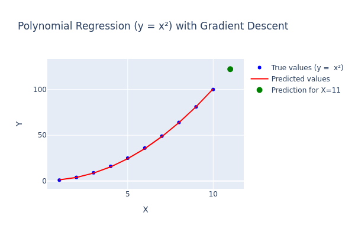

# 📘 Machine Learning for Beginners

Welcome to the official GitHub repository for the **Machine Learning for Beginners** video series on **Debugging with KTiPs** 🎥.  
This repository contains all the source code, examples, and notebooks featured in the YouTube playlist.

> 📺 **Watch the full playlist on YouTube**: [Debugging with KTiPs](https://www.youtube.com/playlist?list=PLFj4gH4BU2fIUI4JnG8PCKA-r8almDDRU)

---

## 🔍 About This Series

Start your Machine Learning journey here!
This beginner-friendly playlist from Debugging with KTiPs walks you step by step through the core concepts of ML—what it is, how it works, and how to build real models using Python.

No advanced math or data science experience required.
We’ll go from basic definitions to building sequence models like LSTMs, with practical code, clear visuals, and honest explanations.

- ✅ Understand key terms like features, labels, and models
- ✅ Learn the full ML workflow: from data to deployment
- ✅ Build real ML models—starting simple and growing more advanced
- ✅ Explore supervised, unsupervised, and sequence learning (like LSTMs)

[Subscribe and follow along at your own pace!](youtube.com/channel/UCc12pd-7Kyg73mU4cbW-mzg?sub_confirmation=1)

---

## 🎬 Video Breakdown

### 📺 Video 1  
**What Is Machine Learning? | Start Your ML Journey (Beginner-Friendly)**  
An introduction to what machine learning is, why it matters, and how to get started.  
▶️ [Watch on YouTube](https://youtu.be/w-ZzzWOFp-M)

In this episode, we cover the core fundamentals of Machine Learning:

- ✅ What ML is — and what it’s not
- ✅ Why you don’t need a math or data science background to get started
- ✅ Key terms: features, labels, and models
- ✅ Overview of a typical ML workflow

We’re starting from scratch—all the way to building advanced models like LSTMs for time-based and sequential data. Whether you're just curious or ready to dive in, this series is designed to be clear, practical, and beginner-friendly.

---

### 📺 Video 2  
**AI vs. ML vs. DL | Supervised, Unsupervised & Reinforcement Learning and Their Use Cases**  
A breakdown of the differences between Artificial Intelligence, Machine Learning, and Deep Learning, including ML types and real-world applications.  
▶️ [Watch on YouTube](https://youtu.be/UtHYovSv41U)

We also break down the difference between Artificial Intelligence, Machine Learning, and Deep Learning, so you’ll know exactly where you are in your ML journey.

Whether you're here to understand the concepts or get ready to build your own models, this is foundational knowledge you don’t want to skip.

#### Covered Topics
- ✅ AI vs Machine Learning vs Deep Learning
- ✅ Supervised Learning (with examples)
- ✅ Unsupervised Learning (with examples)
- ✅ Reinforcement Learning (with dramatic examples)
- ✅ Quick recap
- ✅ Reminder to subscribe and keep going!

---

### 📺 Video 3  
**Build a Supervised Learning Model from Scratch | Polynomial Regression with Gradient Descent in Python**  
A hands-on walkthrough building a simple regression model from scratch and visualizing the learning process using Python.  
▶️ [Watch on YouTube](https://youtu.be/qcKl1bzla_o)



This video guides you through solving the following problem using gradient descent:

$
y_{pred} = w_1 \cdot x + w_2 \cdot x^2 + \text{bias}
$

This is a simple **polynomial regression** task, trained without the help of machine learning libraries — just raw Python and NumPy.

You'll learn how to:

- ✅ Understand polynomial regression intuitively  
- ✅ Implement gradient descent step by step  
- ✅ Visualize predictions using Plotly  
- ✅ Track model loss and improvement over time  
- ✅ Make predictions on unseen data  

🛠️ No scikit-learn. No shortcuts. Just hands-on learning to help you master the core ideas!

---

## 📂 Repository Structure

```bash
├── video-3-polynomial-regression/
│   └── supervised_learning.ipynb
└── README.md
